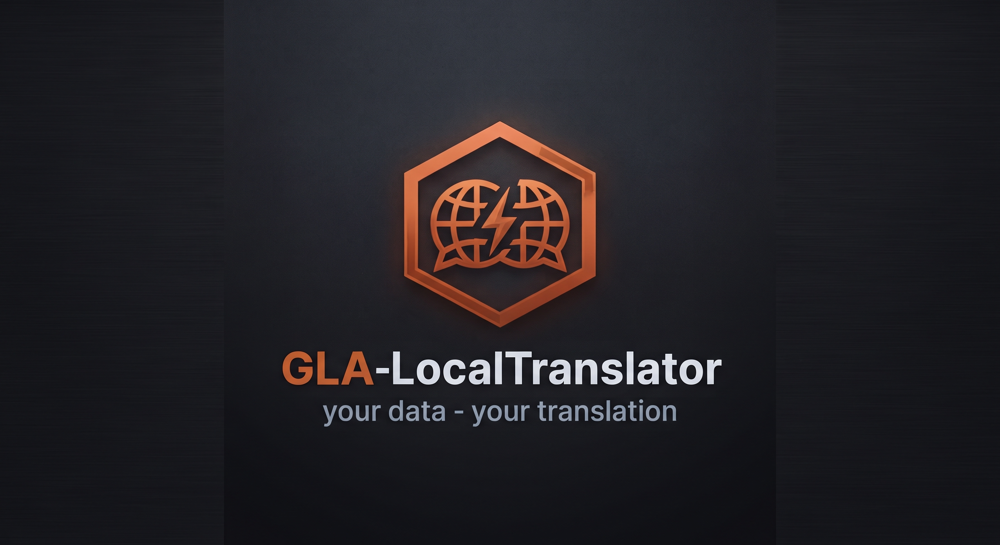

# local-translator

Local, offline-first translation tool with a domain-specific terminology engine.
Split out of [GLA-NeedfulThings](https://github.com/Wewoc/GLA-NeedfulThings) so it can stand on its own.

No cloud dependency for the core translation loop — Ollama runs locally.
Optional final-pass engines (DeepL, LibreTranslate, MyMemory, Lara Translate) can be
enabled via config if you want a cloud API in the mix.

---

> **⚠️ Status: Beta / Work in Progress — use at your own risk.**
> LocalTranslate is under active development. There is **no guarantee of translation quality or
> correctness**, depending also on the selected Ollama model — always review output before relying
> on it, especially for critical, legal, or safety-relevant text. Breaking changes between versions
> are possible. Provided as-is, with no warranty of any kind — see [LICENSE](LICENSE).

---

## `local_translator/` — the app

Two-column browser UI with synchronized scrolling: translate text, export both source
and translation as Markdown. Ollama is the primary engine; the active model can be
switched on the fly via the status bar dropdown.

→ [Documentation](local_translator/README.md)

**⚠ Constraint:** built for iterative, supervised translation (paragraph/page level),
not for unattended bulk-translating of entire books in one pass. The chunking itself
is a sliding window and has no hard length limit — the real constraints are: (1)
cross-chunk context is thin (only the tail of the previous chunk is carried forward),
so long-range coherence over hundreds of chunks isn't guaranteed, (2) no
resume/checkpoint — an interrupted run loses progress, and (3) optional cloud
Final-Pass engines (DeepL, MyMemory, Lara) hit rate limits or costs fast at that
volume.

## `Terminologie-Engine/` — the term-list build pipeline

Offline tool that builds the domain-specific term lists used by `local_translator`'s
runtime terminology engine (`local_translator/terminology/`). Reads MicrosoftTermCollection
and IATE source data, classifies terms by domain ("mindset"), and compiles them into the
lookup tables that `local_translator` reads at runtime.

Domain-specific terms are protected before translation and restored afterwards, so the LLM
can't mistranslate, simplify, or drop established terminology mid-pipeline.

→ [Documentation](Terminologie-Engine/readme.md)

**Note:** no compiled term lists ship in this repo yet — `local_translator/terminology/`
currently only contains the runtime engine code (`terminology.py`). Run the build pipeline
in `Terminologie-Engine/` to generate them; without them, the terminology engine simply
stays inactive and translation falls back to plain Ollama/API output.

## `local_translator/compiler/` — standalone build

Packages `local_translator` as a `--onedir` PyInstaller build (EXE + program folder),
optionally including a packed terminology engine (`Terminologie-Engine/pack_terminology.py`)
as a single portable file next to the EXE.

→ [Documentation](local_translator/compiler/README.md)

---

## Origin

Extracted from GLA-NeedfulThings on 2026-08-14. Both parts were already self-contained —
no other GLA-NT module imports from either folder — so the split carries over the current
file state with no code changes, only two documentation-path corrections in
`Terminologie-Engine/readme.md` (the build pipeline's output path now correctly points at
`local_translator/terminology/`, matching where the runtime engine actually looks for it).

---

## Development approach

**Built with claude.ai"**
following [METHODOLOGY.md](https://github.com/Wewoc/GLA-NeedfulThings/blob/main/METHODOLOGY.md)
in GLA-NeedfulThings.
