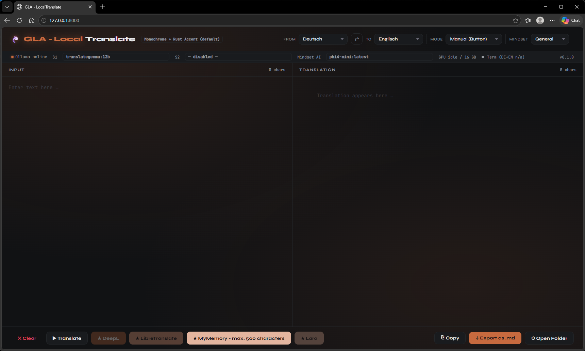
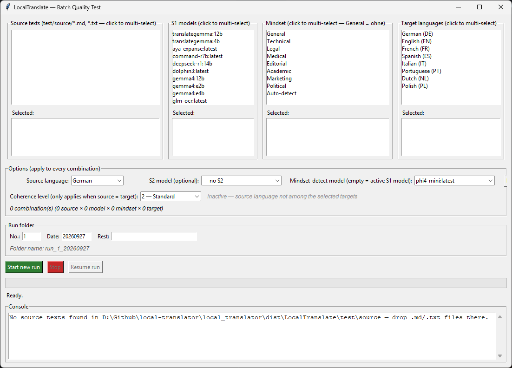

# GLA - LocalTranslate

Local translation tool — part of the [Garmin Local Archive](https://github.com/Wewoc/Garmin_Local_Archive) ecosystem.
Ollama as primary engine, optional Final-Pass via DeepL, LibreTranslate, MyMemory or Lara Translate.
Two-column UI in the browser, synchronized scrolling, MD export of both texts.
Long texts are split into chunks automatically — progress shown live during translation.
The **▶ Translate** button switches to **■ Stop** during translation — click to abort. Completed chunks are preserved.
Mindset auto-detection classifies the text on first typing pause and sets the optimal translation profile automatically.
**Coherence Mode:** set **From** and **To** to the same language to run a monolingual proofreading pass instead of a translation — see below.

**Multi-LLM Pipeline:** An optional S2 model can be selected in the status bar for a quality/terminology pass after S1. S2 uses the same mindset anchor as S1. Recommended: `qwen2.5:7b`.



---

> **⚠️ Use at your own risk.** No guarantee of translation quality or correctness — always review
> output before relying on it, especially for critical, legal, or safety-relevant text. Provided
> as-is, with no warranty of any kind — see [LICENSE](../LICENSE).

---

## Prerequisites

- **Python 3.9+**
- **Ollama Desktop App** running locally
  - Recommended models: `mistral`, `llama3.1`, `phi3`, `gemma2`
  - Pull a model: `ollama pull mistral`
- **Docker Desktop** (only required for LibreTranslate)
- Optional Final-Pass engines — see configuration below

---

## Setup

1. Copy `.env.example` → `.env` and fill in your credentials
2. Adjust `config.yaml` (model, languages, engines)
3. Start Ollama Desktop App
4. Double-click `translator.bat` (Windows) or run `bash translator.sh` (Linux/Mac)
5. Browser opens automatically at `http://127.0.0.1:8000`

For LibreTranslate setup, see `README_libretranslate.md`.

---

## Startup — `translator.bat` / `translator.sh`

The start script handles everything in order:

1. Checks Python and installs dependencies if needed
2. If `libretranslate_enabled: true` in `config.yaml` — asks whether to start LibreTranslate (Docker)
3. If yes: checks Docker availability, starts the container
4. Checks if Ollama is reachable — prompts to retry or skip if not
5. Starts the LocalTranslate server

Docker is only touched if LibreTranslate is both enabled in the config **and** confirmed at startup.

---

## Credentials — `.env`

Sensitive API keys are stored in `.env`, not in `config.yaml`.

```env
DEEPL_API_KEY=

LARA_ACCESS_KEY_ID=
LARA_ACCESS_KEY_SECRET=
```

Never commit `.env` to Git — it is listed in `.gitignore`.

---

## Model Selection

The active Ollama model can be changed on the fly via the dropdown in the status bar.
Available models are loaded automatically from the local Ollama instance.
The default model is set in `config.yaml` — the dropdown overrides it at runtime without restart.

The status bar also shows live VRAM usage: `VRAM: modelname (8.1 / 16 GB)` when a model is loaded, `GPU idle / 16 GB` when nothing is active. GPU total requires `nvidia-smi` — if unavailable, only the used VRAM is shown. Updates every 10 seconds.

The **Term** indicator shows whether the terminology engine is active for the current language pair and mindset: `● Term DE→EN` (active) or `○ Term DE→EN (n/a)` (no terminology list available for this combination — translation runs without term protection). Tooltip: *Domain-specific terms are translated using a terminology table matched to the active mindset.*

---

## Coherence Mode (Monolingual Editing)

When **From** and **To** are set to the same language, LocalTranslate switches from
translation to a coherence pass: a single lightweight edit that smooths abrupt
transitions between sentences and paragraphs in your own text, without translating
and without changing meaning, tone, or register. Useful for proofreading your own
writing before it goes out.

- Runs over the currently selected S1 model — no separate model or setup needed.
- The S2 quality pass and all external Final-Pass engines (DeepL, LibreTranslate,
  MyMemory, Lara) are disabled while Coherence Mode is active — they don't apply
  to same-language text. A small "⬡ Coherence Mode" label appears in the header.
- The result is shown as a diff against your original text (insertions/deletions
  highlighted), so you can see exactly what changed before trusting it.
- If the edit deviates unusually far from the original, a warning banner appears
  above the result — review it closely before using it. The similarity threshold
  that triggers this warning depends on the selected intensity level (see below).

**Intervention depth:** a dropdown next to the "⬡ Coherence Mode" label selects
how far the pass may depart from your original text:

| Level | Scope |
|---|---|
| **1 — Soft** | Only connectors and transition words between sentences. No sentence restructuring. |
| **2 — Standard** (default) | Smooths transitions, restructures a sentence only if necessary for a smooth transition. |
| **3 — Strong** | + may reorder sentences within a paragraph where it improves the flow. |
| **4 — Rewrite Light** | + may rephrase entire sentences and change word choice freely. |
| **5 — Rewrite Medium** | + may reorder content within a paragraph and shorten redundant passages. |
| **6 — Rewrite Heavy** | + may freely restructure and rewrite across paragraphs, using the input as source material. |

Every level keeps the same hard limits regardless of intensity: no new information
added, no existing idea dropped, no meaning/tone change, placeholders and
Markdown/code blocks left untouched.

**Model choice matters more than the level setting.** Levels 4–6 need a
general-purpose editing/chat model — translation-specialized models (e.g.
`translategemma:12b`) tend to leave the text almost unchanged even at "Rewrite
Heavy", regardless of prompt or temperature. `dolphin3` has shown noticeably more
willingness to actually restructure at the higher levels in testing. If a high
intensity level produces only minor edits, try switching the S1 model first
before assuming the level itself isn't working.

Long texts (> `ollama_chunk_size`, default 6000 chars) are edited chunk by chunk
without cross-chunk context — transitions exactly at chunk boundaries may be
smoothed less effectively than transitions within a chunk.

---

## Mindsets

Mindsets control the translation prompt — anchor, tone, style rules, and veto list per domain.

| Mindset | Use case |
|---|---|
| **General** | Everyday documents, mixed content |
| **Technical** | IT, software, RFC, engineering specs |
| **Legal** | Contracts, regulatory documents, official correspondence |
| **Medical** | Clinical texts, research papers, patient documentation |
| **Editorial** | Journalism, essays, long-form prose |
| **Academic** | Scholarly publications, literary analysis, scientific writing |
| **Marketing** | Advertising, social media, product communication |
| **Political** | Speeches, policy papers, official political communication |

**Auto-detection:** In Automatic mode, the mindset is detected on the first typing pause using text excerpts distributed across the document. The dropdown resets to the default mindset after each translation. Manual override is always possible during the typing phase.

Mindsets are defined in `pipeline/mindsets.json` — add or customize entries there. The `default_mindset` is set in `config.yaml`.

**Adding custom terms or a whole new mindset?** See [`docs/MINDSET_HOWTO.md`](docs/MINDSET_HOWTO.md).

---

## Translation Modes

| Mode | Description |
|------|-------------|
| **Automatic (Pause)** | Translates after X seconds of typing stop (configurable via `debounce_seconds`) |
| **Sentencewise (Enter)** | Translates on every Enter press |
| **Manual (Button)** | Only on button press |

---

## Final Pass Engines

Four optional Final-Pass buttons appear in the footer when an engine is configured and enabled.

Recommended workflow:
- During editing → Ollama (local, no cost)
- Final text → one Final-Pass button (one-time quality pass)

| Engine | Signup | Key required | Notes |
|--------|--------|--------------|-------|
| **★ DeepL** | Yes + credit card | Yes (in `.env`) | Best quality for European languages |
| **★ LibreTranslate** | No | Optional | Self-hosted via Docker, see `README_libretranslate.md` |
| **★ MyMemory** | No | No | Works out of the box. Texts over 500 chars are chunked automatically. |
| **★ Lara** | Yes, no credit card | Yes (in `.env`) | 5.000 chars/day free, daily counter shown in button |

Configure engines in `config.yaml`:

```yaml
# DeepL
deepl_free_tier: true            # true = Free API, false = Pro API

# LibreTranslate
libretranslate_url: "http://localhost:5000"
libretranslate_api_key: ""
libretranslate_enabled: false

# MyMemory
mymemory_enabled: true
mymemory_email: ""               # optional: higher daily limit

# Lara Translate
lara_enabled: false
lara_daily_limit: 5000           # local daily counter limit
```

Lara credentials go into `.env`:
```env
LARA_ACCESS_KEY_ID=your-key-id
LARA_ACCESS_KEY_SECRET=your-secret
```
Get credentials at: `app.laratranslate.com/account/credentials`

---

## Lara Daily Counter

The Lara button shows remaining characters for today: `★ Lara (4.200 / 5.000)`.
Usage is tracked locally in `lara_usage.json` and resets at midnight.
The button disables automatically when the daily limit is reached.

---

## LibreTranslate Status

The LibreTranslate button updates dynamically based on the selected language pair:
- `★ LibreTranslate` — online, language pair available
- `★ LibreTranslate (offline)` — service not running
- `★ LibreTranslate (DE not installed)` — language model missing

Use the **■ Stop** button in the status bar to stop the Docker container from within the UI.

---

## Export

**↓ Als .md exportieren** saves two files in the `exports/` folder:
- `translation_de_TIMESTAMP.md` — Source text
- `translation_en_TIMESTAMP.md` — Translation

---

## Performance Logging

After every Ollama translation, timing data is written to `logs/perf.csv`:

| Field | Description |
|---|---|
| `timestamp` | Start time of the chunk |
| `chunk_index` | Position in the chunk sequence (0-based) |
| `chunk_size` | Characters in this chunk |
| `complexity` | `low` < 2000 / `medium` < 4000 / `high` ≥ 4000 chars |
| `time_s1` | S1 translation time in seconds (Coherence Mode runs also log here) |
| `time_s2` | S2 pass time in seconds (0 if disabled, always 0 in Coherence Mode) |
| `model_s1` | Active S1 model |
| `model_s2` | Active S2 model (empty if disabled or in Coherence Mode) |
| `terms_protected` | Number of domain-specific terms replaced by the terminology engine in this chunk (0 if engine inactive or no list available for the language pair) |

The file is created automatically. Separator is configurable via `log_csv_separator` in `config.yaml` — default `";"` for Excel on Windows with German regional settings.

---

## Quality Testing

`test/` contains two reproducible test runners for comparing model/mindset/language combinations. Both call the same `/translate/chunk` endpoint the browser UI uses, and write one result MD per run into `test/results/`, including source text, S1 output, and S2 output (if configured). The CLI runner's report includes the relevant `perf.csv` rows verbatim; the GUI runner builds its own self-contained per-chunk performance table instead (chars/time/similarity per chunk), since a single run can now span a Stop and a Resume across two separate process runs, which a `perf.csv` timestamp-window lookup can't reliably capture.

### GUI — `test_gui.bat` / `python test_gui.py` (or the built `LocalTranslate-Tester.exe`, see `compiler/README.md`)



Pick source texts, S1 models, mindsets (any of the configured ones, "General" as the no-domain baseline, and/or "Auto-detect" via `/mindset/detect`), and target languages by clicking — no config file to get a typo in. Builds the full cartesian product (source × model × mindset × target) and runs it in the background with a progress bar and live log, including a running ETA (`Chunk 5/40 | ETA: ~04:12`, learned per-model from `logs/perf.csv`) and a rough total-time estimate for the configured selection before you even start. Results and each run's progress land in `test/results/run_<nr>_<date>_<rest>/`.

Resume is chunk-accurate, not just per-combination: each result `.md` is written incrementally as chunks finish, so a Stop (or a crash) only ever loses the one chunk in flight, never a whole long document already partway translated — "Resume run" opens a picker listing every incomplete run (not just the most recent one), with how many combinations each has finished, and restores the original source/model/target/mindset selection automatically. A run only gets marked complete once every one of its originally configured combinations has actually finished successfully — resuming after e.g. a model got uninstalled, or retrying after a combination errored out, won't silently mark it done with part of the matrix missing.

Source language, an optional S2 model, the mindset-detect model, and a Coherence Level (1–6, same scale as the app's own selector) are set once per run, not per combination — Coherence Mode itself just falls out of the matrix: pick the source language as one of the target languages too, and those combinations automatically run as a monolingual proofreading pass instead of a translation (same `source_lang == target_lang` check the app itself uses), tagged `[Coherence]` in the log and `_coherence` in the result filename.

Needs the LocalTranslate server running first (`translator.bat`/`.sh`, or the
built `LocalTranslate.exe`) — `test/source/` and `test/results/` aren't
created until the first successful "Reload from server" against it; without
a reachable server, the source list stays empty and no folder appears.

### CLI — `test.bat` / `test.py`

For scripted/unattended runs: `test_config.csv` defines any number of individual runs (source file, S1 model, S2 model, target language, mindset — one row each, no matrix expansion). `test.bat` checks server availability, then runs `test.py`.

### Shared

- `test/source/` — source texts (one file per text type, 300–600 chars recommended)
- Designed to work alongside external model evaluation (Gemini, ChatGPT, etc.) — results are ready to paste into any analysis tool.

---

## Dependencies (automatically installed)

```
fastapi
uvicorn
httpx
pyyaml
python-dotenv
lara-sdk
```

---

## Engine Quality — Testing Notes

The engines in LocalTranslate are not equivalent. They differ fundamentally in how they work,
not just in price or availability.

**LLMs** (Claude, Ollama models) have learned language as a whole — including style, rhythm,
context, and pragmatics. They translate with an understanding of what a sentence means and how
it should read.

**LibreTranslate** is based on Argos Translate, a small neural MT model trained specifically for
translation. It processes text segment by segment without holding the broader context. This works
well for standardised content — UI strings, forms, short technical phrases — but breaks down on
prose with deliberate style and tone.

In informal testing on German engineering/technical prose translated to English, Claude produced
the most natural, publication-ready results — closely matching the original tone and structure.
Among local Ollama models, TranslateGemma-12B and Aya Expanse came closest, followed by
general-purpose models like Mistral and DeepSeek-R1, which stayed accurate but read more
mechanically. Models like Llama 3.2 showed more noticeable phrasing issues. LibreTranslate
consistently struggled with tone and structure on this kind of prose — it works fine for short,
standardized content, but not for stylistically nuanced text.

This is a single-text, single-language-pair impression, not a rigorous benchmark — results vary
by text type, and simpler content (documentation, UI strings) is easier for most models. Use the
test runner in `test/` to compare models on your own texts.

Local models like TranslateGemma-12B trade a small amount of linguistic precision for full control, scalability, and near-zero marginal cost — advantages that become significant at larger volumes.

---

### Recommendations by use case

**Literary or editorial prose** — Use Claude as primary engine. No local model currently matches it
for texts where style matters. Dolphin 3 or Mistral Nemo are the best offline fallbacks, but expect
to do a light editing pass.

**Technical documentation, config comments, UI strings** — Any Ollama model works well here.
LibreTranslate is acceptable if the text is short and repetitive.

**LibreTranslate** — Useful as an offline fallback for simple content, or to check whether a passage
is structurally correct before a full pass. Not suitable for prose with tone.

**MyMemory** — Convenience option for quick checks. Texts over 500 characters are split into chunks automatically. Quality varies per language pair.

**DeepL / Lara** — Cloud engines with the best quality outside of Claude for European language pairs.
Use as a final-pass step on texts that matter.
